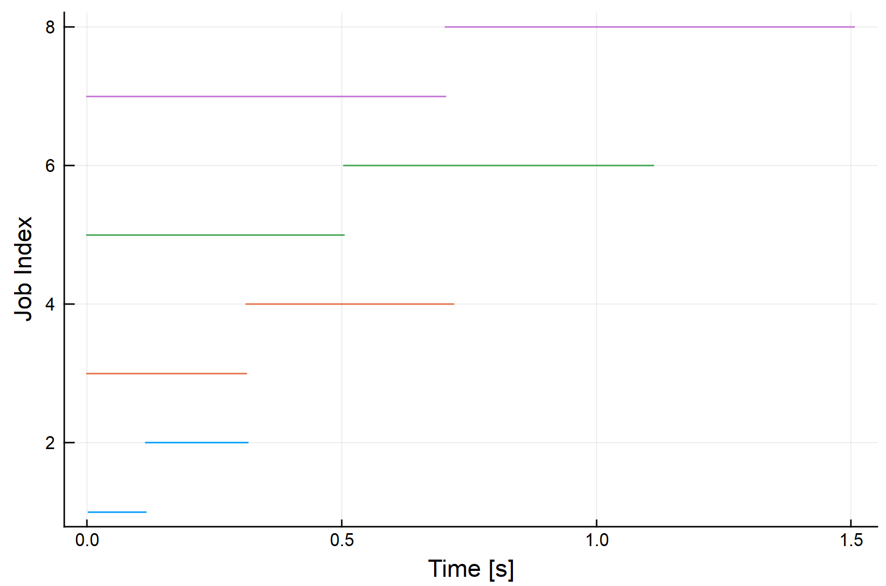
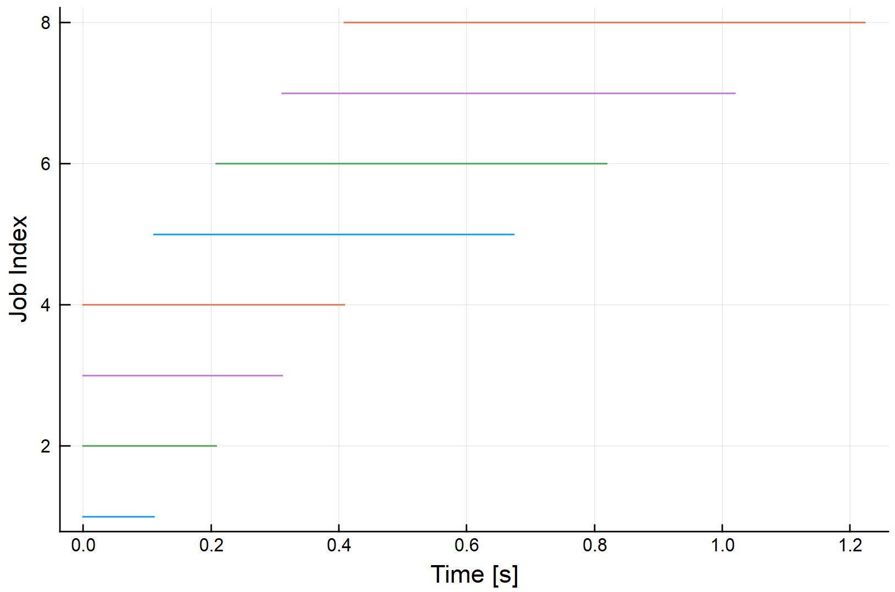

# ThreadPools.jl

_Improved thread management for background and nonuniform tasks_

## Overview

Documentation at https://tro3.github.io/ThreadPools.jl

ThreadPools.jl is a simple package that exposes a few macros and functions
that mimic `Base.Threads.@threads`, `Base.map`, and `Base.foreach`. These 
macros (and the underlying API) handle cases that the built-in functions are 
not always well-suited for:

* A group of tasks that the user wants to keep off of the primary thread
* A group of tasks that are very nonuniform in duration

For the first case, ThreadPools exposes a `@bthreads` ("background threads") 
macro that behaves identically to `Threads.@threads`, but keeps the
primary thread job-free.  There are also related `bmap` and `bforeach`
functions that mimic their `Base` counterparts, but with the same non-primary 
thread usage.

For the second case, the package exposes a `@qthreads` ("queued threads") macro.  
This macro uses a different scheduling strategy to help with nonuniform jobs.  
`@threads` and `@bthreads` first divide the incoming job list into equal job 
"chunks", then launch each 
chunk on a separate thread for processing.  If the jobs are not uniform, this
can lead to some long jobs all getting assigned to one thread, delaying 
completion.  `@qthreads` does not pre-assign threads - it only starts a new 
job as an old one finishes, so if a long job comes along, the other threads 
will keep operating on the shorter ones.  `@qthreads` itself does use the 
primary thread, but its cousin `@qbthreads` uses the same strategy but in the background.
There are also `qmap`, `qforeach`, `qbmap`, and `qbforeach`.

### Simple Macro/Function Selection

|  Task Type           | Foreground (primary allowed)                                                          |  Background (primary forbidden)                                                          |
|:-------------------- |:------------------------------------------------------------------------------------- |:---------------------------------------------------------------------------------------- |
| **Uniform tasks**    | `Base.Threads.@threads` `ThreadPools.pmap(fn, itrs)` `ThreadPools.pforeach(fn, itrs)` | `ThreadPools.@bthreads` `ThreadPools.bmap(fn, itrs)` `ThreadPools.bforeach(fn, itrs)`    |
| **Nonuniform tasks** | `ThreadPools.@qthreads` `ThreadPools.qmap(fn, itrs)` `ThreadPools.qforeach(fn, itrs)` | `ThreadPools.@qbthreads` `ThreadPools.qbmap(fn, itrs)` `ThreadPools.qbforeach(fn, itrs)` |


### Job Logging for Performance Tuning

Each of the above macros comes with a logging version that allows the user to 
analyze the performance of the chosen strategy and thread count:

| Task Type            | Foreground                                                                                     |  Background                                                                                       |
| :------------------- |:---------------------------------------------------------------------------------------------- |:------------------------------------------------------------------------------------------------- |
| **Uniform tasks**    | `ThreadPools.@logthreads` `ThreadPools.logpmap(fn, itrs)` `ThreadPools.logpforeach(fn, itrs)`  | `ThreadPools.@logbthreads` `ThreadPools.logbmap(fn, itrs)` `ThreadPools.logbforeach(fn, itrs)`    |
| **Nonuniform tasks** | `ThreadPools.@logqthreads` `ThreadPools.logqmap(fn, itrs)` `ThreadPools.logqforeach(fn, itrs)` | `ThreadPools.@logqbthreads` `ThreadPools.logqbmap(fn, itrs)` `ThreadPools.logqbforeach(fn, itrs)` |

Please see below for usage examples.

## Usage

Each of the simple API functions can be used like the `Base` versions of the 
same function: 

```julia
julia> @qbthreads for x in 1:3
         println("$x $(Threads.threadid())")
       end
2 3
3 4
1 2

julia> bmap([1,2,3]) do x
         println("$x $(Threads.threadid())")
         x^2
       end
2 3
3 4
1 2
3-element Array{Int64,1}:
 1
 4
 9
```
Note that both of the above examples use the background versions and no 
threadid==1 is seen.  Also note that while the execution order is not 
guaranteed across threads, but the result of `bmap` will of course match 
the input. 

## Logger Usage

The logging versions of the above functions all produce an `AbstractThreadPool` 
object that has an in-memory log of the start and stop times of each job that 
ran through the pool.  A `PlotRecipe` from `RecipesBase` is exposed in the 
package, so all that is needed to generate a visualization of the job times is 
the `plot` command from `Plots`.  In these plots, each job is shown by index,
start time, and stop time and is given a color corresponding to its thread:

```julia
julia> using Plots

julia> pool = logpforeach(x -> sleep(0.1*x), 1:8);

julia> plot(pool)
```


```julia
julia> pool = logqforeach(x -> sleep(0.1*x), 1:8);

julia> plot(pool)
```



Note the two different scheduling strategies are seen in the above plots. The 
`pforeach` log shows that the jobs were assigned in order: 1 & 2 to 
thread 1, 3 & 4 to thread 2, and so on.  The `qforeach` shows that each
job (any thread) is started when the previous job on that thread completes.
Because these jobs are very nonuniform (and stacked against the first
strategy), this results in the pre-assign method taking 25% longer.


## Simple API

Each function of the simple API tries to mimic an existing function in `Base` 
or `Base.Threads` to keep any code rework to a minimum.

### Regular Versions

* [`@bthreads`](@ref)
* [`@qthreads`](@ref)
* [`@qbthreads`](@ref)
* [`pmap(fn, itr)`](@ref)
* [`bmap(fn, itr)`](@ref)
* [`qmap(fn, itr)`](@ref)
* [`qbmap(fn, itr)`](@ref)
* [`pforeach(fn, itr)`](@ref)
* [`bforeach(fn, itr)`](@ref)
* [`qforeach(fn, itr)`](@ref)
* [`qbforeach(fn, itr)`](@ref)

### Logging Versions

* [`@logthreads`](@ref)
* [`@logbthreads`](@ref)
* [`@logqthreads`](@ref)
* [`@logqbthreads`](@ref)
* [`logpmap(fn, itr)`](@ref)
* [`logbmap(fn, itr)`](@ref)
* [`logqmap(fn, itr)`](@ref)
* [`logqbmap(fn, itr)`](@ref)
* [`logpforeach(fn, itr)`](@ref)
* [`logbforeach(fn, itr)`](@ref)
* [`logqforeach(fn, itr)`](@ref)
* [`logqbforeach(fn, itr)`](@ref)

```@docs
@bthreads
@qthreads
@qbthreads
pmap(fn::Function, itr)
bmap(fn, itr)
qmap(fn, itr)
qbmap(fn, itr)
pforeach(fn::Function, itr)
bforeach(fn, itr)
qforeach(fn, itr)
qbforeach(fn, itr)

@logthreads
@logbthreads
@logqthreads
@logqbthreads
logpmap(fn::Function, itr)
logbmap(fn, itr)
logqmap(fn, itr)
logqbmap(fn, itr)
logpforeach(fn::Function, itr)
logbforeach(fn, itr)
logqforeach(fn, itr)
logqbforeach(fn, itr)
```

## Composable API

### Functions

The above macros invoke two base structures, [`ThreadPools.StaticPool`](@ref) and 
[`ThreadPools.QueuePool`](@ref), each of which can be assigned to a subset of the 
available threads.  This allows for composition with the `pwith` and `@pthreads` 
commands, and usage in more complex scenarios, such as stack processing.

```@docs
pwith(fn::Function, pool)
@pthreads
pmap(fn::Function, pool, itr)
pforeach(pool, fn::Function, itr::AbstractVector)
```

### AbstractThreadPool
```@docs
Base.close(pool::ThreadPools.StaticPool)
```

### StaticPools
```@docs
ThreadPools.StaticPool()
ThreadPools.LoggedStaticPool()
```


### QueuePools
```@docs
ThreadPools.QueuePool()
ThreadPools.LoggedQueuePool()
Base.put!(pool::ThreadPools.QueuePool, t::Task)
Base.put!(pool::ThreadPools.QueuePool, fn::Function, args...)
Base.take!(pool::ThreadPools.QueuePool)
Base.iterate(pool::ThreadPools.QueuePool, state)
results(pool::ThreadPools.QueuePool)
isactive(pool::ThreadPools.QueuePool)
```
